# Show-Tie : Verifiable Cross-Chain Invitation & Social Graph Protocol

## Demo Txs 
Create invitation from Base => Sepolia, accept invitation on Sepolia and generate attestations

**1. createInvitation on Base Sepolia**
https://sepolia.basescan.org/tx/0xa6291300e3c9e7c602be76300a3b5dc0f3c40aba1d3ed5c196c295b217882aca
event attestation ID => 3403 => 0xd4b

**2. Sign Scan (Inviter Attestation)** 
https://testnet-scan.sign.global/attestation/onchain_evm_84532_0xd4b

**3. CCIP Scan (Base => Sepolia)**
https://ccip.chain.link/#/side-drawer/msg/0xaf009ceae978638b6aba46d6a0371cf1d0a51e18c4e55353d2c9efd285e1e3e8

**4. Transaction Hash of accept Invitation**
https://sepolia.etherscan.io/tx/0x3621aeb1151cfcd4385dafb932e9b51a8686b10d0cc4b3459d2ec6ff82c75dae
event attestation ID => 1052 => 0x41c

**5. Sign Scan (Invitee & Captcha)**
https://testnet-scan.sign.global/attestation/onchain_evm_11155111_0x41c

## How It's Made

Our project revolves around creating a secure, verifiable, and cross-chain invitation system for decentralized applications (DApps). We've integrated captcha authentication with attestation mechanisms to ensure both security against bots and verifiable user relationships. Here's how we built it:

#### Chain A Implementation

### Chain B Implementation

```mermaid
sequenceDiagram
    participant CCIP
    participant SignProtocolContract
    participant SmartContract
    participant Client
    participant Invitee
    
    
    CCIP ->> SmartContract: Receive Cross-Chain message from the chain A
    SmartContract ->> SmartContract: Verify Inviter's Signature
    SmartContract　->> SmartContract:Store invitation data
    Invitee ->> Client:Connect Wallet、Pass the Capthca authentication
    Our Wallet ->> Client: Generate Signature of captcha authentication
    Client ->> SmartContract: Call approveInvitation function
    SmartContract　->> SignProtocolContract: Create invitee attestation
    SignProtocol ->> SchemaHook : Verify the invitee's signature and captcha authentication
    SignProtocolContract ->> Client: Return Invitee attestation ID
```

### Overall Invitation Flow

#### 1. Inviter Creates and Sends Invitation Across Chains

1.1 Cross-Chain Invitation Creation: 
Invitors can generate invitations to DApps on our protocol that are valid across multiple blockchain networks.

1.2 Attestation via Sign Protocol: When creating an invitation, an attestation is generated using the Sign Protocol. This allows anyone to verify the validity of the invitation.
1.3 Transmission Using CCIP: Invitations are sent to any desired blockchain network via Chainlink's Cross-Chain Interoperability Protocol (CCIP), providing flexibility and broad reach.

#### 2. Invitee Performs Captcha Verification and Accepts Invitation

2.1 Captcha Authentication: Invitees complete a captcha verification on our application to confirm they are not bots.
2.2 Access Token Verification and Signing: The application verifies the access token and signs it using our private key.
2.3 Invitation Acceptance: The invitee inputs the inviter's address, signs the transaction, and accepts the invitation.

#### 3. Contract Verifies Signatures and Captcha, Then Creates Attestation

3.1 Verification with Sign Protocol's Schema Hook: We use the Schema Hook feature of the Sign Protocol to verify both the invitee's signature and the captcha authentication signature within the smart contract.
3.2 Universal Verification Logic: By employing the Schema Hook, any attestation—even those created outside our contract—runs the same verification logic, enhancing the attestation's validity.
3.3 Attestation Creation: An attestation is only generated when both signatures are successfully verified, ensuring security and trustworthiness.

#### 4. DApps Verify Attestation and Distribute Rewards
4.1 Attestation Verification: DApps can verify the attestations created by both the inviter and the invitee.
4.2 Signature Validation: Since the attestation contains signatures, anyone can validate its authenticity.
4.3 Reward Distribution: Once all attestations are verified, DApps distribute rewards to both the inviter and the invitee as an incentive for participation.

## Notable Technologies and Innovations

### 1. Cross-Chain Invitation & Captcha Attestation

**Enhanced Bot Prevention**
By combining captcha authentication with the Sign Protocol's attestation, we provide robust protection against bots.
**Trustworthy Attestations for Other Protocols**
If the captcha signer is trusted, these attestations can be utilized by other protocols, extending the utility beyond our system.
**Verifiable Inviter-Invitee Relationship**
We establish a verifiable relationship between the inviter and invitee, which other protocols can leverage securely.
### 2. Invitation Design Using CCIP
**On-Chain Cross-Chain Verification**
Utilizing CCIP, we've constructed an invitation mechanism that is both on-chain and verifiable across different blockchain networks.
**Trust-Minimized Approach for DApps**
DApps can overcome cross-chain barriers in a trust-minimized manner, allowing them to reach and engage with a larger user base effectively.

### Technical Highlights
**Integration with Sign Protocol**
The use of the Sign Protocol ensures that all invitations and acceptances are securely attested and verifiable.
**Schema Hook Utilization**
By implementing the Schema Hook, we maintain consistent verification logic across various contracts, bolstering security and validity.
**Cross-Chain Interoperability via CCIP**
CCIP enables seamless communication and invitation transmission across multiple blockchains, enhancing accessibility and user engagement.

----------------------------
By integrating these technologies, we've developed a system that not only secures against bot interactions but also creates verifiable relationships between users that can be trusted and utilized by the broader blockchain community. Our approach facilitates a more connected and secure ecosystem, allowing DApps to expand their reach across chains without compromising on trust or security.

## Contract Addresses

### Ethereum Sepolia

| Contract       | Address                                    |
|----------------|--------------------------------------------|
| Showtie        | `0x835f7f0678FF1903D5198B82c9A2eD1F3238D606` |
| ShowtieHook    | `0x883178d94E7cB18b4e4d077CDd0cEB98d34dAd37` |
| ShowtieERC20   | `0x6640f61BeEF7cEd4eE72A95a48d1Ce65b8ac5762` |

### Base Sepolia

| Contract       | Address                                    |
|----------------|--------------------------------------------|
| Showtie        | `0x892a7880F0Ae0Ac74A27f14aCe0cB27b9b3d041A` |
| ShowtieHook    | `0x23a5ffb86b6c1e51dedb53681449a909a8ce2f53` |
| ShowtieERC20   | `0x7BD72b6D118F763832185744Ee054A550B6eb4cf` |

### Celo Testnet

| Contract      | Address                                    |
|---------------|--------------------------------------------|
| Showtie       | `0x82852a3b2D6d5Cc86fD112dcD6ed34Bc09445846` |
| ShowtieHook   | `0xD53EA3598F3b2332FB82A132B0Dc7a17ce0E5dB8` |
| ShowtieERC20  | `0xeB56Ffab8d01a2252D4A07953578b85bE8bdd084` |

### Scroll Sepolia

| Contract      | Address                                    |
|---------------|--------------------------------------------|
| Showtie       | `0xD53EA3598F3b2332FB82A132B0Dc7a17ce0E5dB8` |
| ShowtieHook   | `0x900E61f9CF646453aa208e423372B87FA0C53846` |
| ShowtieERC20  | `0x82852a3b2D6d5Cc86fD112dcD6ed34Bc09445846` |

## Schemas

#### Crosschain Invitation & Captcha Schema
🌍 **Sepolia**  
[View Schema on SignScan](https://testnet-scan.sign.global/schema/onchain_evm_11155111_0x304)

🌍 **Base Sepolia**  
[View Schema on SignScan](https://testnet-scan.sign.global/schema/onchain_evm_84532_0x483)

🤎 **Scroll**
[View Schema on SignScan]([https://testnet-scan.sign.global/schema/onchain_evm_44787_0x33](https://testnet-scan.sign.global/schema/onchain_evm_534351_0x63))

🟡 **Celo**
[View Schema on SignScan](https://testnet-scan.sign.global/schema/onchain_evm_44787_0x35)

| Field Name            | Type      | Description                                                                                      |
|------------------------|-----------|--------------------------------------------------------------------------------------------------|
| `address invitee`      | `address` | The address of the user who was invited.                                                        |
| `address inviter`      | `address` | The address of the user who issued the invitation.                                              |
| `uint256 dappsId`      | `uint256` | The identifier of the Dapp.                                                                     |
| `bytes signature`      | `bytes`   | A signature created by the Invitee, signing the Inviter's address and the Dapps ID.             |
| `bytes captchaSignature` | `bytes` | A signature created by the CAPTCHA verifier, signing the Inviter and Dapps ID.                 |
| `address captchaSigner`| `address` | The address of the CAPTCHA verifier.                                                           |
| `uint256 sourceChainSelector` | `uint256` | The chain identifier where the Inviter created the invitation (used for cross-chain invitations). |
| `uint256 targetChainSelector` | `uint256` | The chain identifier where the Invitee received the invitation (used for cross-chain invitations). |

#### Inviter Schema

🌍 **Sepolia**  
[View Schema on SignScan](https://testnet-scan.sign.global/schema/onchain_evm_11155111_0x2ed)

🌍 **Base Sepolia**  
[View Schema on SignScan](https://testnet-scan.sign.global/schema/onchain_evm_84532_0x41e)

🟡 **Celo**
[View Schema on SignScan](https://testnet-scan.sign.global/schema/onchain_evm_44787_0x33)

🤎 **Scroll**
[View Schema on SignScan]([https://testnet-scan.sign.global/schema/onchain_evm_44787_0x33](https://testnet-scan.sign.global/schema/onchain_evm_534351_0x61))

| Name           | Type      | Description                                                                                      |
|----------------|-----------|--------------------------------------------------------------------------------------------------|
| `inviter`      | `address` | The address of the user who issued the invitation.                                              |
| `signature`    | `bytes`   | A signature created to verify the authenticity of the invitation.                               |
| `dappsId`      | `uint256` | The identifier of the Dapp.                                                                     |
| `originalChain`| `uint256` | The chain identifier where the invitation was originally created.                               |
| `targetChain`  | `uint256` | The chain identifier where the invitation was intended to be received (used for cross-chain invitations). |
